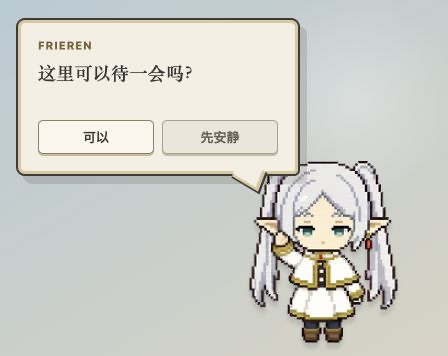
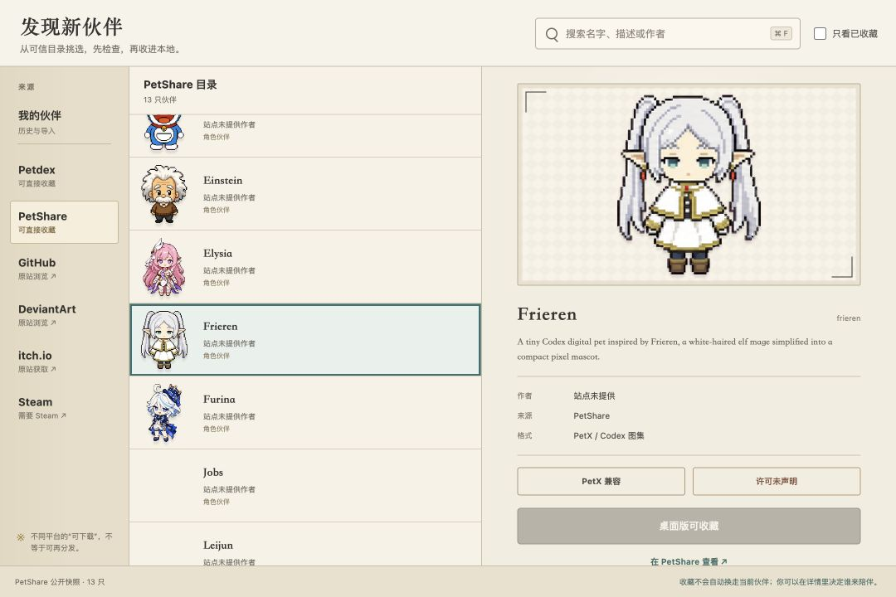
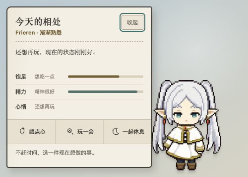
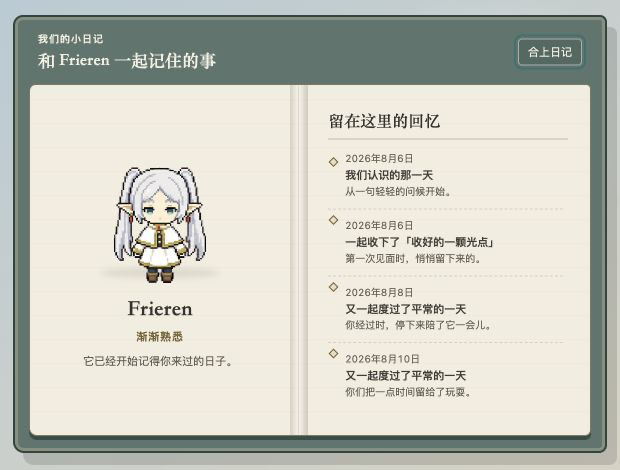

# PetX Desktop

一只住在桌面上的、本地优先的 PetX 伙伴。

<p align="center">
  
</p>

PetX Desktop 使用 [PetX React](https://www.npmjs.com/package/@petx/react) 渲染动画伙伴，并通过 Tauri 2 打包为 macOS、Windows 和 Linux 桌面应用。它把陪伴放在任务之前：不用打卡，不会因为离线而生病、掉级或失去关系。

[项目主页](https://ichendev.github.io/petx-desktop/) · [GitHub 仓库](https://github.com/IchenDEV/petx-desktop)

## 界面一览

### 发现新伙伴



| 照料与状态 | 关系纪念册 |
| --- | --- |
|  |  |

> 四张图均由当前代码在本地开发服务器中实渲染，并按对应桌面窗口尺寸采集；它们不是原生 Tauri 窗口实拍、概念稿或生成图。欢迎气泡、照料与纪念册使用仓库内置的开发预览状态；宠物库展示的是截图时读取到的公开目录快照。

## 核心体验

- **关系优先**：初次见面、摸摸、玩耍、喂点心和一起休息会自然形成关系；成长按共同相处的日期计算，不设签到、经验条或离线惩罚。
- **本地记忆**：昵称、照料状态、关系阶段与最多 7 段共同记忆只保存在本机。
- **安静陪伴**：透明、无边框、始终置顶；支持拖动位置、S/M/L 尺寸、安静时段和“安静一小时”。
- **我的伙伴**：按最近使用与收藏时间保留本地历史；即使远端下架或离线，已收藏伙伴仍可切换。
- **发现与导入**：浏览 Petdex 与 PetShare，搜索、预览并收藏；也可以导入已解压的 PetX 兼容包。
- **关系隔离**：每只伙伴按来源与 slug 保存自己的昵称、照料、关系和记忆；收藏不会自动替换当前伙伴。
- **桌面感知**：macOS 可选择感知离开/回来、电量、CPU、聚合网络流量、低电量和温度状态，并做出克制的回应。
- **原生入口**：提供托盘菜单、宠物右键菜单、独立设置窗口和开机启动。

更完整的产品术语见 [CONTEXT.md](./CONTEXT.md)。

## 快速开始

需要：

- Node.js `^20.19.0` 或 `>=22.12.0`
- Rust stable
- 当前平台对应的 [Tauri 系统依赖](https://v2.tauri.app/start/prerequisites/)

安装锁定依赖并启动桌面版：

```bash
npm ci
npm run desktop:dev
```

仅预览 React 界面：

```bash
npm run dev
```

构建 GitHub Pages 静态主页：

```bash
npm run pages:build
```

产物会写入忽略版本控制的 `_site/`；[pages.yml](./.github/workflows/pages.yml) 会在相关文件进入 `main` 后部署它。仓库首次部署前，需要在 GitHub 的 **Settings → Pages → Source** 中选择 **GitHub Actions**。

## 如何相处

- 按住宠物本体直接拖动位置。
- 单击宠物打招呼，双击宠物一起玩。
- 在气泡中选择“照料一下”，或右键宠物打开照料、纪念册、宠物库、设置、临时安静与退出。
- 在宠物库收藏伙伴后选择“设为当前伙伴”；切换会立即同步到桌面与纪念册，重启后仍会恢复。
- 从其他商店下载兼容包后，解压并在“我的伙伴”选择其中的 `pet.json`；PetX 会校验并复制同目录图集。
- 托盘菜单可以重新显示宠物；关闭设置或宠物库窗口不会退出应用。

## 本地优先与安全边界

- 偏好、关系与记忆留在本机；离线不会造成惩罚。
- 桌面感知默认关闭，采集结果不进入关系记忆。前台感知只读取应用名称，不读取窗口标题、文档、输入内容、域名、请求或其他应用的通知。
- Petdex 只下载静态 `pet.json` 与受支持的 PNG/WebP 图集；PetShare 只读取 V2 WebP 图集。两者都不运行脚本、安装器或站点 ZIP。
- “我的伙伴”独立于远端目录保存本地收藏、最近使用时间与使用次数；用户导入仅接受通过校验的 `pet.json + spritesheet.webp/png` 兼容包。
- 远端资源需要通过 HTTPS 来源白名单、响应大小、文件类型、PetX V1/V2 尺寸、清单身份和 SHA-256 校验，再以原子方式写入应用数据目录。
- 预览缓存限制为 256 MB / 160 项，同时最多处理 2 个图像任务，并按最近使用时间淘汰。
- GitHub、DeviantArt、itch.io 和 Steam 只在系统浏览器打开原站；PetX 不复用登录 Cookie，也不绕过购买、订阅或平台客户端。

目录审核或“允许下载”不等于获得角色版权。公开展示、再分发或商用前，请确认投稿者和权利方的许可要求。

## 平台状态

透明窗口、托盘菜单和安装包面向 macOS、Windows 与 Linux。macOS 会隐藏 Dock 图标；Windows/Linux 的伙伴主窗口会跳过任务栏，设置与宠物库保持普通窗口行为。

当前原生桌面感知和 PetX 自己的系统通知只在 macOS 实现；Windows/Linux 会安全回退为“不可用”，不会伪造系统状态。

## 验证

```bash
npm run typecheck
npm test
npm run build
cargo test --manifest-path src-tauri/Cargo.toml --lib
```

## 构建与发布

在目标操作系统上运行：

```bash
npm run desktop:build
```

产物位于 `src-tauri/target/release/bundle/`。

- [build-desktop.yml](./.github/workflows/build-desktop.yml) 在 pull request、`main` 分支推送和手动触发时构建 macOS Universal、Windows 与 Linux 安装包。
- 推送 `v*` tag 会触发 [release-desktop.yml](./.github/workflows/release-desktop.yml)，并创建包含三平台安装包的 GitHub Release 草稿。
- macOS 本地构建使用 ad-hoc 签名。公开分发应配置 Developer ID 并完成公证。
- 透明窗口依赖 Tauri 的 `macOSPrivateApi`，因此当前形态不适合提交 Mac App Store。

## PetX 资产

默认资产位于 `public/pets/frieren/`，遵循 PetX V2（8 × 11、单帧 192 × 208）标准。桌面版可以切换宠物库中通过校验的本地伙伴；开发者也可以替换同目录下的 `pet.json` 与 `spritesheet.webp`。

## 移动端路线

Tauri 2 可以复用当前 React UI 和 PetX 资源到 Android/iOS，但系统小组件需要单独的原生适配：Android App Widget 受刷新频率限制，iOS WidgetKit 需要时间线或交互触发帧。当前版本不把这些路线图能力标记为“已支持”。
